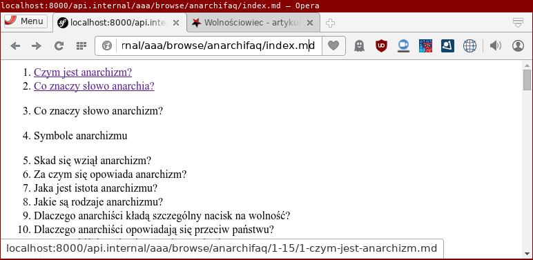

# wolnosciowiec-wiki

[](https://travis-ci.org/Wolnosciowiec/wolnosciowiec-wiki)

Converts git repository into a website. Currently it generates static websites by compiling to the HTML.
The plans are to move forward and allow dynamic rendering of eg. Twig templates with passing the request
to the template and allowing to list items with pagination stored in YAML files in some directory.



### How it works?

1. A git push on github is made, then the github notifies the service
2. The service is compiling source files eg. Markdown to HTML
3. A website is ready at given address of the service

### Which format does it support?

_Wolnościowiec Wiki_ supports all formats that are handled by [ContentCompilerBundle](https://github.com/Wolnosciowiec/ContentCompilerBundle)
including **Twig**, **Markdown** and **Plain HTML**.

### Setup

- Clone the repository.
- composer install --no-dev
- Create the `app/config/wiki.yml`, here is the example structure:

```
wiki:
    repositories:
        anarchifaq:
            address: "https://github.com/Wolnosciowiec/anarchi-faq-pl"
            branch:  "master"
            fetcher: "git"
```

- Configure and start the webserver
For development use `php bin/console server:start` and point your browser to the http://localhost:8000
